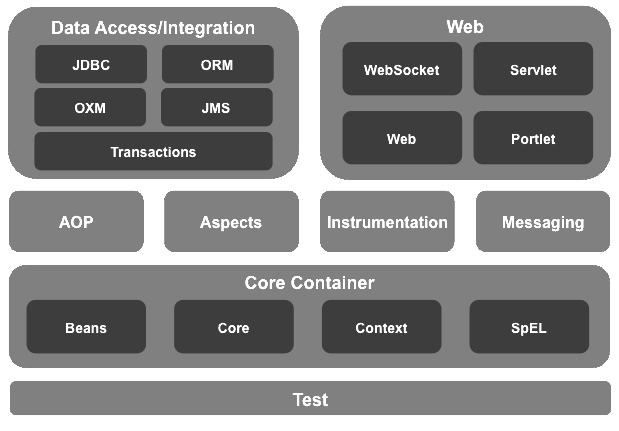
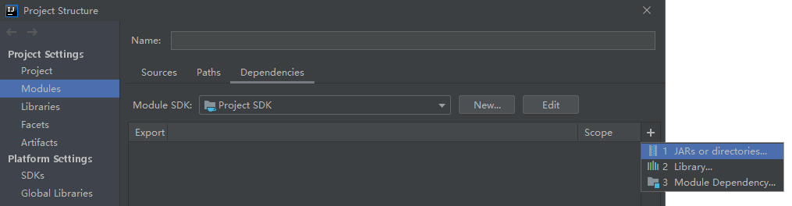

<link rel="stylesheet" href="https://zhmhbest.gitee.io/hellomathematics/style/index.css">

# [Spring](../index.html)

[TOC]

## Spring Framework

### 控制反转（Inversion of Control, IOC）

通过**XML配置**、**工厂模式**和**反射**等技术，把对象创建和调用过程交给Spring进行管理，以降低耦合度。

### 面向切面编程（Aspect Oriented Programming, AOP）

交叉业务的编程问题即为面向切面编程。AOP的目标就是使交叉业务模块化。

### IDEA配置

<!-- https://repo1.maven.org/maven2/com/alibaba/druid/ -->

添加[**Spring Framework**](https://repo.spring.io/release/org/springframework/spring/)和其它相关依赖的jar包路径到IDEA项目依赖。

## IOC

- 相关辅助对象
  - [`TestBeanConfig.java`](src/main/java/ioc/TestBeanConfig.java)
  - [`Holder4String.java`](src/main/java/ioc/Holder4String.java)
  - [`Holder4Object.java`](src/main/java/ioc/Holder4Object.java)
  - [`Holder4Collection.java`](src/main/java/ioc/Holder4Collection.java)
  - [`Holder4HS.java`](src/main/java/ioc/Holder4HS.java)
  - annotation
    - [`User.java`](src/main/java/ioc/annotation/User.java)
    - [`Name.java`](src/main/java/ioc/annotation/Name.java)
    - [`Gender.java`](src/main/java/ioc/annotation/Gender.java)
    - [`Age.java`](src/main/java/ioc/annotation/Age.java)
- 属性注入
  - [`demoAttributeInjection.java`](src/main/java/ioc/demoAttributeInjection.java)
  - [`demoAttributeInjection.xml`](src/main/java/ioc/demoAttributeInjection.xml)
- 特殊符号、Object注入
  - [`demoSpecialInjection.java`](src/main/java/ioc/demoSpecialInjection.java)
  - [`demoSpecialInjection.xml`](src/main/java/ioc/demoSpecialInjection.xml)
- Collection、Map注入
  - [`demoCollectionInject.java`](src/main/java/ioc/demoCollectionInject.java)
  - [`demoCollectionInject.xml`](src/main/java/ioc/demoCollectionInject.xml)
- 自动注入
  - [`demoAutoInject.java`](src/main/java/ioc/demoAutoInject.java)
  - [`demoAutoInject.xml`](src/main/java/ioc/demoAutoInject.xml)
- 工厂方法
  - [`demoFactory.java`](src/main/java/ioc/demoFactory.java)
  - [`demoFactory.xml`](src/main/java/ioc/demoFactory.xml)
- 生命周期
  - [`demoLifeCycle.java`](src/main/java/ioc/demoLifeCycle.java)
  - [`demoLifeCycle.xml`](src/main/java/ioc/demoLifeCycle.xml)
- 注解方法
  - [`demoAnnotation.java`](src/main/java/ioc/demoAnnotation.java)
  - [`demoAnnotation.xml`](src/main/java/ioc/demoAnnotation.xml)
- 无配置注解方法
  - [`demoAnnotationNoXml.java`](src/main/java/ioc/demoAnnotationNoXml.java)

## AOP

### 基本概念

#### 连接点

可以被增强的方法。

#### 切入点

实际被增强的方法。

#### 通知

增强的逻辑部分，常见的有

- 前置通知：`@Before`
- 返回通知：`@After`
- 环绕通知：`@Around`
- 最终通知：`@AfterReturning`
- 异常通知：`@AfterThrowing`

#### 切面

把通知应用到切入点的过程。

### AOP实现方式

#### 测试用类

- [`UserInterface.java`](src/main/java/aop/UserInterface.java)
- [`User.java`](src/main/java/aop/User.java)

#### 实现方式

- 有接口使用[`JDK`](src/main/java/aop/demoProxyJDK.java)动态代理；
- 没有接口使用[`CGLIB`](src/main/java/aop/demoProxyCGLIB.java)动态代理（在子类中增强父类方法）。

在Spring中使用AspectJ进行AOP操作。

- [`UserProxy.java`](src/main/java/aop/annotation/UserProxy.java)
- [`demo.java`](src/main/java/aop/demoProxySpring.java)
- [`demo.xml`](src/main/java/aop/demoProxySpring.xml)

## <a href="javascript:gotoRepository('src')">查看仓库</a>

