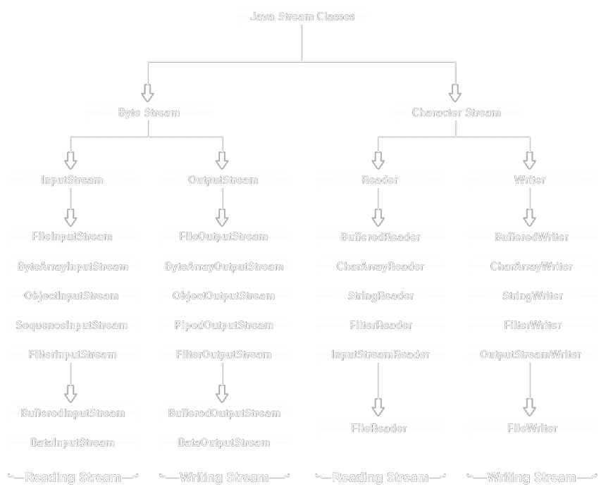

<link rel="stylesheet" href="https://zhmhbest.gitee.io/hellomathematics/style/index.css">

# [Java](../index.html)

[TOC]

## Hello

- [`Hello`](src/demoHello.java)
- [`String`](src/demoString.java)
- [`Scanner`](src/demoScanner.java)
- [`Random`](src/demoRandom.java)
- [`DateTime`](src/demoDateTime.java)
- [`Lambda`](src/demoLambda.java)

## [`IOStream`](src/demoIOStream.java)

## Collection

### [`List`](src/demoCollectionList.java)

#### ArrayList

- 内部通过数组实现；
- 适合随机查找和遍历；
- 不适合随机插入和删除；
- 内存不够时默认扩展$50\%+1$个。

#### LinkedList

- 链表结构存储数据；
- 适合动态插入和删除；
- 随机访问速度较慢
- 提供操作表头、表尾的方法，可以当作堆栈、队列和双向队列使用。

#### Vector

- 内部通过数组实现；
- 支持线程同步；
- 访问速度慢于ArrayList；
- 内存不够时默认扩展1倍。

### [`Set`](src/demoCollectionSet.java)

#### HashSet

- 基于HashMap实现；
- 非线程安全。

### [`Queue`](src/demoCollectionQueue.java)

#### Deque

双端队列支持在两端插入和移除元素。

#### PriorityQueue

优先队列，根据排序规则决定谁在队头，谁在队尾

## [`Map`](src/demoMap.java)

### HashMap

- 根据键的Hash值存储数据
- 遍历时取得数据的顺序是完全随机的
- 最多只允许一条记录的Key为null，多条Value为null
- 不支持线程同步

### LinkedHashMap

- 保存了记录的插入顺序；
- 一般情况下遍历时会比HashMap慢。

### TreeMap

根据键值排序，默认按键值的升序排序。

### Hashtable

- 无论Key还是Value都不能为null；
- 线程安全的。
