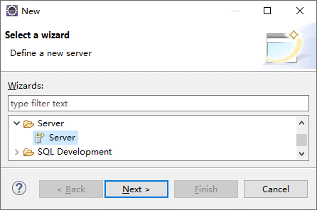
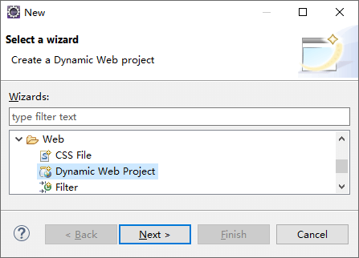
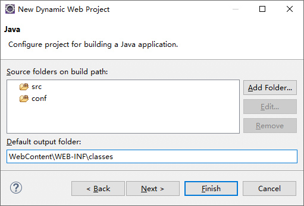
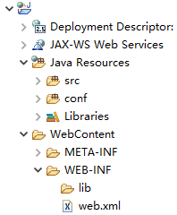

<link rel="stylesheet" href="https://zhmhbest.gitee.io/hellomathematics/style/index.css">
<script src="https://zhmhbest.gitee.io/hellomathematics/style/index.js"></script>

# [Nutz](../index.html)

[TOC]

## Hello

<!-- Eclipse IDE for Enterprise Java Developers -->

### 准备工作

#### 数据库

```SQL
-- nutzbook
-- nutz@localhost:nutz
CREATE DATABASE `nutzbook` CHARACTER SET 'utf8mb4' COLLATE 'utf8mb4_general_ci';
CREATE USER 'nutz'@'localhost' IDENTIFIED BY 'nutz';
REVOKE ALL ON *.* FROM 'nutz'@'localhost';
GRANT ALL PRIVILEGES ON `nutzbook`.* TO 'nutz'@'localhost' WITH GRANT OPTION;
```

#### JAR包

- [`nutz-1.r.60.jar`](https://jfrog.nutz.cn/artifactory/jcenter/org/nutz/nutz/1.r.60/nutz-1.r.60.jar)
- [`mysql-connector-java-5.1.40.jar`](https://jfrog.nutz.cn/artifactory/jcenter/mysql/mysql-connector-java/5.1.40/mysql-connector-java-5.1.40.jar)
- [`druid-1.0.26.jar`](https://jfrog.nutz.cn/artifactory/jcenter/com/alibaba/druid/1.0.26/druid-1.0.26.jar)

### 创建项目

- 
- 
- 
- 
- `WebContent\WEB-INF\classes`
- 

### 配置

#### Tomcat交由Nutz处理

`WebContent/WEB-INF/web.xml`

@import "demo/WebContent/WEB-INF/web.xml"

#### 主模块

主模块应该在`web.xml`中指明。

- `@Modules(scanPackage=true)` : 自动搜寻子模块
- `@IocBy(...)` : 设置应用所采用的IOC容器
- `@SetupBy(...)` : 应用启动以及关闭时的工作

`src/example/nutzbook/MainModule.java`

@import "demo/src/example/nutzbook/MainModule.java"

#### 配置数据库信息

`conf/ioc/dao.js`

@import "demo/conf/ioc/dao.js" {code_block=true}

#### 模型

`src/example/nutzbook/model/User.java`

@import "demo/src/example/nutzbook/model/User.java"

`src/example/nutzbook/MainSetup.java`

@import "demo/src/example/nutzbook/MainSetup.java"

#### 视图

`WebContent/index.jsp`

@import "demo/WebContent/index.jsp" {as='html'}

#### 控制器

Controller在Nutz中称为入口函数。

- `@At` : 入口函数对应的 URL
- `@Ok` : 成功视图
- `@Fail` : 失败视图
- `@AdaptBy` : HTTP 参数适配方式
- `@Filter` : 过滤器
- `@Encoding` : 输入输出编码

`src/example/nutzbook/bean/controller/UserController.java`

@import "demo/src/example/nutzbook/bean/controller/UserController.java"
