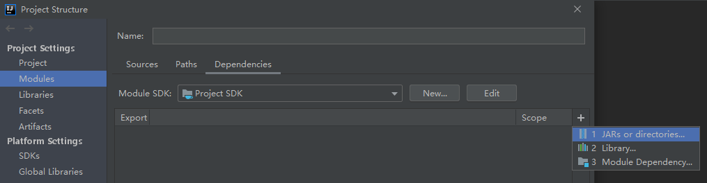

<link rel="stylesheet" href="https://zhmhbest.gitee.io/hellomathematics/style/index.css">

# [Spring](../index.html)

[TOC]

## 理解Spring

### 控制反转（Inversion of Control, IOC）

通过**XML配置**、**工厂模式**和**反射**等技术，把对象创建和调用过程交给Spring进行管理，以降低耦合度。

### 面向切面编程（Aspect Oriented Programming, AOP）

交叉业务的编程问题即为面向切面编程。AOP的目标就是使交叉业务模块化。

## HelloSpring

<!-- https://repo1.maven.org/maven2/com/alibaba/druid/ -->

添加[**Spring Framework**](https://repo.spring.io/release/org/springframework/spring/)的jar包路径到IDEA项目依赖。

### IOC

#### 例

@import "demo/ioc/README.md"

### AOP

有接口使用`JDK`动态代理；没有接口使用`CGLIB`动态代理（在子类中增强父类方法）。

在Spring中使用`AspectJ`(`spring-aspects`)进行AOP操作。

- [`cglib`](https://repo1.maven.org/maven2/cglib/cglib/)
- [`aopalliance`](https://repo1.maven.org/maven2/aopalliance/aopalliance/)
- [`aspectjweaver`](https://repo1.maven.org/maven2/aspectj/aspectjweaver/)

**连接点**

可以被增强的方法。

**切入点**

实际被增强的方法。

**通知**

增强的逻辑部分。常见的有

- 前置通知
- 返回通知
- 环绕通知
- 最终通知
- 异常通知

**切面**

把通知应用到切入点的过程。

#### 例

@import "demo/aop/README.md"
